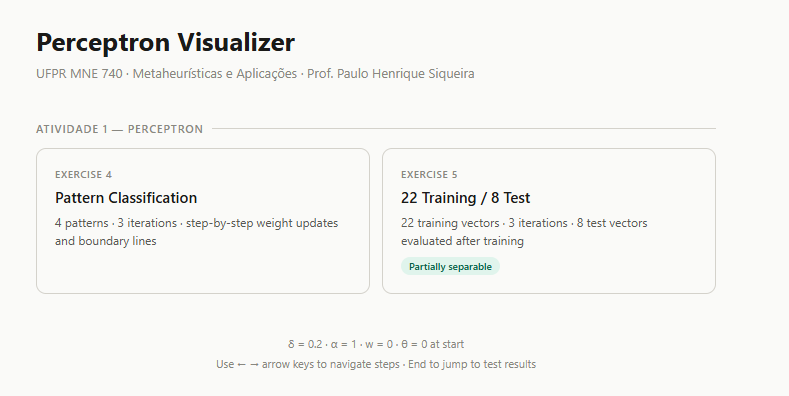
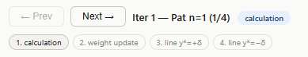
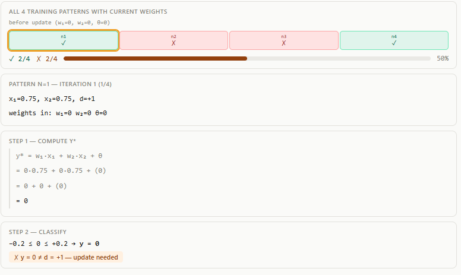
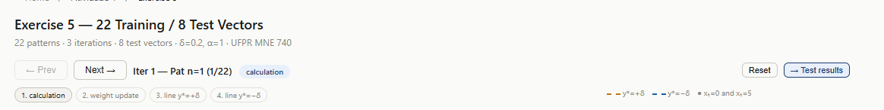

# Perceptron Visualizer

Visualizador passo a passo do algoritmo Perceptron — desenvolvido para a disciplina MNE 740 da UFPR (Metaheurísticas e Aplicações, Prof. Paulo Henrique Siqueira).

Cobre os Exercícios 4 e 5 da apostila: atualização de pesos, fronteiras de decisão e avaliação do conjunto de teste, detalhado fase por fase.

**Link do site:** https://MateusBalotin.github.io/metaheuristicas/

---

## Como usar o site

### 1. Página inicial

Acesse o link acima. Você verá dois cards em **Atividade 1 — Perceptron**:



- **Exercício 4** — 4 padrões, classificação binária (classes A e B)
- **Exercício 5** — 22 vetores de treinamento + 8 vetores de teste

Clique no exercício que quiser explorar.

---

### 2. Navegando pelos passos



Cada padrão passa por **4 fases**. Use os botões **← Prev** e **Next →** ou as setas do teclado para avançar:

| Fase | O que aparece |
|------|---------------|
| **1. Cálculo** | y\* calculado com os pesos atuais, passo a passo |
| **2. Atualização de pesos** | Novos valores de w₁, w₂, θ (ou "sem mudança" se acertou) |
| **3. Linha y\*=+δ** | Fronteira superior derivada do zero |
| **4. Linha y\*=−δ** | Fronteira inferior + as duas retas lado a lado |

Atalhos do teclado: `→` avança, `←` volta, `Home` reinicia, `End` pula direto para os resultados de teste.

---

### 3. Lendo os painéis



**Lado esquerdo:**
- O **rastreador de pontuação** mostra todos os padrões com os pesos atuais — verde = certo, vermelho = errado, borda laranja = padrão sendo processado agora
- Abaixo aparecem as informações do padrão (x₁, x₂, d) e a matemática da fase atual

**Lado direito (gráfico):**
- Pontos verdes = classe A (d=+1), pontos vermelhos = classe B (d=−1)
- **Brilho amarelo** nos pontos classificados corretamente com os pesos atuais
- **Linha tracejada laranja** = fronteira superior (y\*=+δ)
- **Linha tracejada azul** = fronteira inferior (y\*=−δ)

---

### 4. Resultados do teste (Exercício 5)



O Exercício 5 tem 66 passos de treinamento. Para pular direto para a avaliação dos 8 vetores de teste, clique em **→ Test results** ou pressione `End`.

---

## Rodando localmente

```bash
pip install flask
python app.py
# abre http://localhost:5000 automaticamente
```

---

## Parâmetros (conforme a apostila)

| Símbolo | Valor | Significado |
|---------|-------|-------------|
| δ | 0.2 | Metade da zona morta |
| α | 1.0 | Taxa de aprendizado |
| w₁, w₂, θ | 0 | Pesos iniciais |

Regra: y\* > +δ → y=+1 / y\* < −δ → y=−1 / entre os dois → y=0 (atualiza pesos)

---

## Estrutura do projeto

```
├── perceptron.py      ← o algoritmo
├── app.py             ← servidor Flask
├── docs/              ← site estático (GitHub Pages)
│   ├── index.html
│   ├── ex4.html
│   ├── ex5.html
│   └── js/
│       ├── perceptron.js
│       ├── ui.js
│       └── style.css
├── assets/            ← imagens do README
├── static/js/         ← JS para o Flask
├── templates/         ← templates HTML do Flask
└── requirements.txt
```
